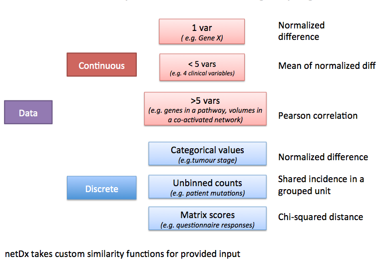

# Create Patient Similarity Networks (or Feature Design)

<a id="overview"></a>
## Overview
Defining meaningful patient similarity networks (or features) is the key to building a high-performing classifier. It is also crucial to using netDx for clinical discovery. When designing patient similarity networks, two considerations are the level at which individual variables should be grouped, and the measure used to define patient similarity. 

## Grouping Variables: What makes an input network?
In a given datatype, not all measured variables are equally predictive. Moreover some groupings of variables may be more informative about mechanism, perhaps because they use prior knowledge. Such variables are more interpretable, as they reflect some process of clinical or biological relevance. For each datatype, the user needs to decide which level of variable-grouping to apply. 

This table provides some examples for different types of data. Consider the lung cancer example from the [Introduction](Introduction), and assume we measure: 34 clinical variables; 20,000 genes; 16 metabolites; and genetic mutations from whole-genome sequencing.

<table cellspacing="0" border=1>
<tr>
	<th>Type of data</th>
	<th>1 variable per network</th>
	<th>All variables in one network</th>
	<th>Subset of variables per network</th>
</tr>
<tr>
	<td style="spec">Clinical data</td>
	<td style="">Age or sex or smoking frequency <i>(34 networks)</i></td>
	<td style="">Clinical data <i>(1 network)</i></td>
	<td style="">a set of 5 variables measuring lung condition <i>(2-27 networks)</td>
</tr>
<tr>
	<td style="spec">Gene expression</td>
	<td style="">Top 10 known high-risk genes, one gene per network<i>(10 networks)</i></td>
	<td style="">All gene expression data <i>(1 network)</i></td>
	<td style="">Genes grouped by pathways <i>(~2,000 networks)</td>
</tr>
<tr>
	<td style="spec">Metabolic data</td>
	<td style="">3 metabolites identified through other statistical analyses<i>(3 networks)</i></td>
	<td style="">All metabolite data <i>(1 network)</i></td>
	<td style="">Metabolites grouped by biological process they affect <i>(3-4 networks)</td>
</tr>
<tr>
	<td style="spec">Genetic data</td>
	<td style="">Top genes from GWAS studies <i>(~10 networks)</i></td>
	<td style="">All genetic data <i>(1 network)</i></td>
	<td style="">Genes grouped by pathways <i>(~2,000 networks)</td>
</tr>
</table>

## Choosing a similarity metric
Patient similarity can be measured in different ways for different types of input data. Here is a set of recommended metrics to start with, depending on what the type of data is and how many variables were grouped to create a given net.



<a id="summary"> </a>
## Summary table
<table cellspacing="0" border=1>
<tr> 
	<th>Type of data</th>
	<th>Example</th> 
	<th>Similarity measure</th>
	<th>Example call</th> 
</tr>
<tr> <th class="spec">Continous, over 5 vars </th>             
	<td class="">Gene expression</td>
	<td class="">Pearson correlation</th>
	<td class="code">makePSN_NamedMatrix(dat,dat_names, 
        groupList,outDir,<b>writeProfiles=TRUE</b>)
</tr>
<tr> <th class="spec">Continous, 2-5 vars </th>             
	<td class="">Gene expression</td>
	<td class="">Average normalized difference (custom)</th>
	<td class="code">makePSN_NamedMatrix(dat,dat_names,myGroup,
			outDir,simMetric="custom",customFunc=normDiff2,
				sparsify=TRUE)
</tr>
<tr> <th class="spec">Discrete, mutation data</th>             
	<td class="">Gene mutations</td>
	<td class="">Co-occurrence in same unit (e.g. gene or pathway)</th>
	<td class="code">**makePSN_RangeSets**(mutation_GR, pathway_GRList,outDir)
</tr>
</table>

### Defining custom similarity functions
netDx is agnostic to the choice of similarity metric. Set the `simMetric` argument of `makePSN_NamedMatrix` to `custom` to provide a user-defined similarity metric. Be aware that the choice of similarity metric could increase false positives or false negatives during feature selection. Build controls to guard against these. 

<a id="pearson"></a>
## Expression data
This situation applies to a table of >5 values with continuous-valued measures. An example is a table of gene expression data, with ~20,000 measures per patient. Another is proteomic data with ~20 measures per patient.

Suggested metric: *Pearson correlation*.
This is the default similarity metric for `makePSN_NamedMatrix()` so no special specification is required.

**Note:** Be sure to set `writeProfiles=TRUE`.

<a id="avg_normdiff"></a>
## Fewer than 5 datapoints 
Pearson correlation is not a stable measure of similarity when there are fewer than 5 variables per patient. An alternate similarity measure in such a situation is the **average normalized difference for each variable**.


```{r}
#' Similarity by average of normalized difference
#'
#' @details Similarity measure for network with 2-5 variables. 
#' Defined as the average of normalized difference for each of the 
#' member variables
#' @param x (matrix) rows are patients, columns are values for component
#' variables
normDiff_avg <- function(x) {

	# normalized difference for a single variable
	normDiff <- function(x) {
	    nm <- colnames(x)
	    x <- as.numeric(x)
	    n <- length(x)
	    rngX  <- max(x,na.rm=T)-min(x,na.rm=T)
	    
	    out <- matrix(NA,nrow=n,ncol=n);
	    # weight between i and j is
	    # wt(i,j) = 1 - (abs(x[i]-x[j])/(max(x)-min(x)))
	    for (j in 1:n) out[,j] <- 1-(abs((x-x[j])/rngX))
	    rownames(out) <- nm; colnames(out)<- nm
	    out
	}

	sim <- matrix(0,nrow=ncol(x),ncol=ncol(x))
	for (k in 1:nrow(x)) {
		tmp <- normDiff(x[k,,drop=FALSE])
		sim <- sim + tmp
		rownames(sim) <- rownames(tmp)
		colnames(sim) <- colnames(tmp)
	}
	sim <- sim/nrow(x)
	sim
}
```

Use in `netDx`: Given
* `dat`matrix with 5 variables (5xN matrix, where N is number of patients)
* `dat_names` vector with variable names
* `myGroup` list with the group name as key and members as variables,

then the call to create networks would be:
```
makePSN_NamedMatrix(dat,dat_names,myGroup,
			outDir,simMetric="custom",customFunc=normDiff_avg,
			sparsify=TRUE)
```
**Note:**
* `simMetric="custom"`
* `customFunc` points to the custom function definition
* `writeProfiles=FALSE`
* `sparsify=TRUE` *keep only the strongest edges for efficient memory use*

<a id="binary_nets"></a>
## Range-based data (genetic mutations)
Creating patient data from genomic events such as genetic mutations or DNA copy number polymorphisms, requires a different design for creating PSN.

*This section coming soon - 170927*


<a id="howto_emap"></a>
## Setting up to get an enrichment map


