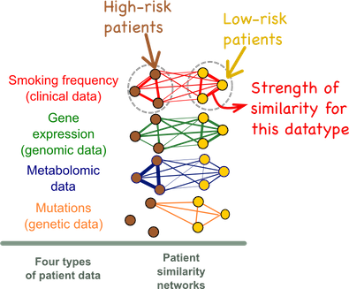
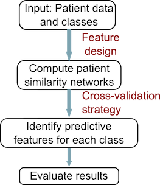
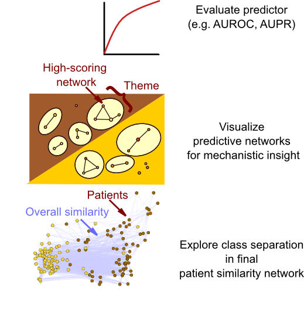

# Introduction

[**netDx**](https://github.com/BaderLab/netDx) is a **patient classifier** algorithm that can integrate several types of patient data into a single model. It specializes in the use of genomic data, which is distinct in the number and correlation structure of measures (e.g. 20,000 genes)It does this by converting each type of data into a view of patient similarity; i.e. by converting the data into a graph in which more similar patients are tightly linked, while less similar patients are not so tightly linked.  

## Motivation

In this example, we try to predict which patients are at high-risk for lung cancer. We have four types of data: relevant clinical variables, including smoking frequency, gene expression data, genetic mutations, and metabolomic data. netDx converts the data into 4 views of patient similarity (edge strength

In the graphs above, the nodes are patients and the edges are weighted by similarity for that particular datatype. It is evident that the high-risk patients form a strongly interconnected cluster based on smoking frequency (red network) but that the clustering is less evident for gene expression data (green network).

## How netDx works
The conceptual workflow for netDx is shown below. netDx starts with patient data as above. It allows users to define similarity for each of the input datatypes and creates the resulting patient similarity networks. It then uses machine learning to identify which of the input features were predictive for each class. Finally, it uses the predictive features to classify new patients of unknown type. 

An important aspect of the predictor is the score associated with each input feature. This score indicates the frequency with which cross-validation identified a particular network as predictive for a patient label, and is a measure of predictive power. A threshold can be applied to this score, making passing networks "feature-selected".

## Output
netDx broadly has two purposes. First, it serves as a classifier that can integrate heterogeneous datatypes. Second, it serves as a tool for clinical discovery and research, as identified features may provide mechanistic insight into the condition under study or identify new biomarkers.

netDx therefore provides several types of output that allow the user to examine the nature of the predictor: 
* **Predicted labels** for test patients. If [nested cross-validation](Predictor_Designs.md#nestedcv) is used, labels for all iterations are provided, along with individual-level classification accuracy.
* **Summary network scores:** Network-level scores for all cross-validation folds. Applying a cutoff for these results in "feature-selected" networks. 
* Detailed output: All **[intermediate results](Output_Files.md)**, showing network rankings across cross-validation
* An **overall patient similarity network** created by integrating feature-selected networks
* Where applicable, a network visualization of selected features (also called an EnrichmentMap) is generated. This view shows the major themes present in feature-selected variables.

